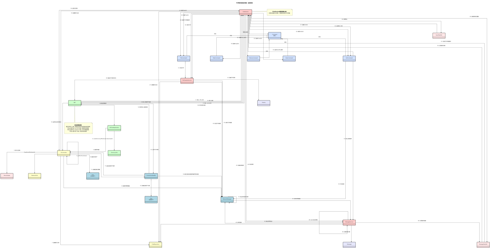

# P2P 聊天系统项目文档

## 目录

- [P2P 聊天系统项目文档](#p2p-聊天系统项目文档)
  - [目录](#目录)
  - [1. 系统功能概述](#1-系统功能概述)
    - [1.1 主要功能](#11-主要功能)
    - [1.2 核心流程](#12-核心流程)
  - [2. 系统设计原理](#2-系统设计原理)
    - [2.1 P2P 通信模型](#21-p2p-通信模型)
    - [2.2 数据持久化](#22-数据持久化)
  - [3. 系统内部逻辑组织结构](#3-系统内部逻辑组织结构)
    - [3.1 总体结构](#31-总体结构)
    - [3.2 各层详细说明](#32-各层详细说明)
    - [3.3 Maven 项目结构](#33-maven-项目结构)
  - [4. 系统总体方案](#4-系统总体方案)
    - [4.1 系统架构](#41-系统架构)
    - [4.2 类图](#42-类图)
    - [4.3 系统交互流程](#43-系统交互流程)
  - [5. 运行与部署说明](#5-运行与部署说明)
    - [构建项目](#构建项目)
    - [运行应用](#运行应用)
  - [6. 测试策略](#6-测试策略)

## 1. 系统功能概述

### 1.1 主要功能

P2P 聊天系统是一个基于命令行的点对点即时通讯工具，它允许两个用户在没有中央服务器的情况下直接进行通信。主要功能包括：

1.  **双向连接模式**:
    -   **发送模式**: 用户可以作为客户端，主动连接到指定的IP地址和端口。
    -   **接收模式**: 用户可以作为服务器，在指定端口上监听并接受来自其他用户的连接。

2.  **实时文本聊天**:
    -   连接建立后，双方可以进行实时的文本消息交换。
    -   支持多行输入和显示。

3.  **文件传输**:
    -   用户可以通过特定命令（如 `/file`）在聊天会话中发送和接收文件。
    -   文件保存在本地的 `downloads` 目录中。

4.  **历史记录**:
    -   所有聊天记录（不包括文件）都将保存在本地的 SQLite 数据库 (`chat_history.db`) 中。
    -   用户可以通过命令查看与特定用户的历史消息。

5.  **命令系统**:
    -   提供了一系列命令，如 `/help`、`/file`、`/history`、`/clear`、`/exit` 等，方便用户操作。

### 1.2 核心流程

系统启动后，用户首先需要配置本地端口。然后，主菜单提供"发送模式"和"接收模式"选项。

-   在 **接收模式** 下，应用启动一个服务器套接字，等待客户端连接。
-   在 **发送模式** 下，应用会提示用户输入对方的IP和端口，然后尝试建立连接。

一旦连接建立，系统会创建一个 `ChatSession` 实例来管理该会话，允许双方进行通信，直到有一方断开连接。

## 2. 系统设计原理

### 2.1 P2P 通信模型

本系统采用了一个混合的 P2P 模型。虽然它不依赖于中央服务器来中继消息，但在连接建立阶段，一个节点必须充当服务器（监听方），而另一个节点充当客户端（发起方）。一旦 TCP 连接建立，通信就是完全双向和对等的。

-   **网络层**: 使用 Java 的 `java.net.Socket` 和 `java.net.ServerSocket` 实现底层的 TCP 通信。
-   **连接管理**: `NetworkManager` 类封装了套接字的创建和管理，简化了连接过程。

### 2.2 数据持久化

为了保存用户数据和聊天记录，系统采用了嵌入式数据库 SQLite。

-   **数据库**: `chat_history.db` 文件存储了所有信息。
-   **数据访问**: `ChatRepository` 类作为数据访问层，封装了所有与数据库交互的 SQL 操作，如保存用户信息和消息、查询历史记录等。这种设计将数据逻辑与业务逻辑分离。

## 3. 系统内部逻辑组织结构

### 3.1 总体结构

系统采用经典的分层架构，将职责清晰地分离到不同的包中，以提高代码的可维护性和可扩展性。


### 3.2 各层详细说明

1.  **核心层 (core)**
    -   `BackgroundService`: 抽象类，提供统一的后台服务生命周期管理，简化线程操作。各种需要在后台持续运行的服务（如消息接收）都可以继承此类。

2.  **模型层 (model)**
    -   `User`: 定义了用户的基本信息，包括用户名、IP地址和端口。
    -   `Message`: 代表一条聊天消息，包含发送者、接收者、内容和时间戳。
    -   `FileInfo`: 用于文件传输，封装了文件名和大小。

3.  **数据层 (repository)**
    -   `ChatRepository`: 负责所有数据库操作，是数据持久化的唯一接口。

4.  **网络层 (network)**
    -   `NetworkManager`: 管理网络连接的建立，无论是作为服务器还是客户端。

5.  **服务层 (service)**
    -   `MessageService`: 处理文本消息的发送和接收逻辑。
    -   `FileTransferService`: 负责文件的收发和I/O操作。

6.  **UI层 (ui)**
    -   `P2PChatApplication`: 应用程序的主入口。
    -   `CliController`: 核心控制器，管理应用的生命周期和用户的主要交互流程。
    -   `ChatSession`: 管理一个具体的P2P聊天会话。
    -   `command`: 包含所有可执行的命令，如 `HelpCommand`, `FileCommand` 等，遵循命令模式。
      - 命令模式的使用使得新命令可以很容易地添加到系统中，而不需要修改现有代码，符合开闭原则。
      - 每个命令类都实现了 `Command` 接口，拥有一致的执行方法，同时封装了具体的行为逻辑。

7.  **工具层 (util)**
    -   `ANSIcolor`: 提供终端颜色显示的ANSI转义码常量。
    -   `DirectoryUtils`: 处理目录相关操作，如确保文件存储目录存在。
    -   `NetworkUtils`: 提供网络相关的实用方法，如获取本地IP地址。

### 3.3 Maven 项目结构

```
P2P_Chat/
├── src/
│   ├── main/
│   │   └── java/
│   │       └── com/
│   │           └── uednd/
│   │               └── p2pchat/
│   │                   ├── core/
│   │                   │   └── BackgroundService.java
│   │                   ├── model/
│   │                   │   ├── FileInfo.java
│   │                   │   ├── Message.java
│   │                   │   └── User.java
│   │                   ├── network/
│   │                   │   └── NetworkManager.java
│   │                   ├── repository/
│   │                   │   └── ChatRepository.java
│   │                   ├── service/
│   │                   │   ├── FileTransferService.java
│   │                   │   └── MessageService.java
│   │                   ├── ui/
│   │                   │   └── cli/
│   │                   │       ├── ChatSession.java
│   │                   │       ├── CliController.java
│   │                   │       ├── ConnectionHandler.java
│   │                   │       ├── command/
│   │                   │       │   ├── ClearCommand.java
│   │                   │       │   ├── Command.java
│   │                   │       │   ├── ExitCommand.java
│   │                   │       │   ├── FileCommand.java
│   │                   │       │   ├── HelpCommand.java
│   │                   │       │   └── HistoryCommand.java
│   │                   │       └── util/
│   │                   │           ├── InputHandler.java
│   │                   │           └── MenuDisplay.java
│   │                   ├── util/
│   │                   │   ├── ANSIcolor.java
│   │                   │   ├── DirectoryUtils.java
│   │                   │   └── NetworkUtils.java
│   │                   └── P2PChatApplication.java
│   └── test/
│       └── java/
│           └── com/
│               └── uednd/
│                   └── p2pchat/
│                       ├── model/
│                       │   ├── MessageTest.java
│                       │   └── UserTest.java
│                       └── util/
│                           └── NetworkUtilsTest.java
├── docs/
│   ├── diagrams/
│   │   ├── class_diagram.puml
│   │   ├── collaboration_diagram.puml
│   │   ├── sequence_diagram.puml
│   │   ├── state_diagram.puml
│   │   ├── system_architecture.puml
│   │   └── out/
│   │       ├── class_diagram.png
│   │       ├── collaboration_diagram-*.png
│   │       ├── sequence_diagram.png
│   │       ├── state_diagram.png
│   │       └── system_architecture.png
│   ├── project_document.md
│   └── project_requirements.md
├── pom.xml
└── README.md
```

## 4. 系统总体方案

### 4.1 系统架构

系统架构旨在通过分层来解耦不同部分的功能。UI层处理用户输入，服务层执行业务逻辑，网络层处理通信，而数据层管理持久化，各层之间通过定义好的接口进行交互。

### 4.2 类图

详细的类结构和它们之间的关系在以下类图中展示：

  

### 4.3 系统交互流程

一个典型的"发送消息"交互流程如下：

1.  **用户A**（发送方）和 **用户B**（接收方）都启动了应用。
2.  用户B选择"接收模式"，应用开始在指定端口监听。
3.  用户A选择"发送模式"，输入用户B的IP和端口，然后发起连接。
4.  `NetworkManager` 在用户B端接受连接，在用户A端建立连接。
5.  系统为双方创建一个 `ChatSession` 实例。
6.  用户A在命令行输入消息并按回车。
7.  `ChatSession` 将输入传递给 `MessageService`。
8.  `MessageService` 通过Socket将消息发送出去。
9.  用户B的 `ChatSession` 在一个单独的监听线程中通过 `MessageService` 接收到消息。
10. 消息显示在用户B的控制台，并由 `ChatRepository` 保存到数据库。

下图展示了系统的状态转换流程：


下图展示了系统中对象之间的协作关系：



下图展示了消息处理的时序关系：


## 5. 运行与部署说明

### 构建项目

本项目使用Maven进行依赖管理和构建。要构建项目，请执行：

```bash
mvn clean package
```

这将在`target`目录下生成可执行的JAR文件。

### 运行应用

可以通过以下命令运行应用：

```bash
java -jar target/P2P_Messaging_System-1.0.0.jar
```

## 6. 测试策略

项目采用了单元测试来验证核心功能的正确性。测试主要集中在以下几个方面：

1. **模型层测试**：验证`User`和`Message`类的基本功能。
2. **工具类测试**：验证`NetworkUtils`等工具类的功能正确性。

要运行测试，可以执行：

```bash
mvn test
```

未来的测试计划包括：
- 添加服务层的集成测试
- 添加网络连接的模拟测试
- 实现端到端测试场景 